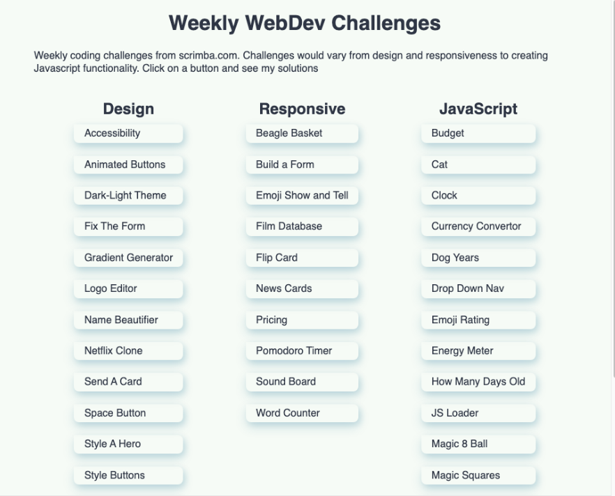

#  Scrimba Weekly Web Dev Challenges
[Weekly challenges from Scrimba](https://scrimba.com/)

# Live Site
[Weekly Web Dev Challenges](https://scrimba.com/scrim/ck6pEwtM)

## Table of Contents
[Introduction](#Introduction)

[Motivation](#Motivation)

[Built With](#built-with)

[License](#License)

[Acknowledgements](#Acknowledgements)

## Introduction
I put this project together from [The Weekly Web Dev Challenge ](https://scrimba.com/learn/weeklychallenge). I began with completing each challenge and then compiling them into a single web application, categorizing them by which ones were design based challenges, responsive challenges, and challenges that required Javascript. 

## Motivation
I started these challenges to stretch my HTML, CSS, and JavsScript skills, as well as work on a deadline to get each challenge done.

## Built With
- HTML
- CSS
- JS
- SASS

## License
[MIT](https://choosealicense.com/licenses/mit/)

## Acknowledgements
[Scrimba](https://scrimba.com/) for putting out weekly challenges
